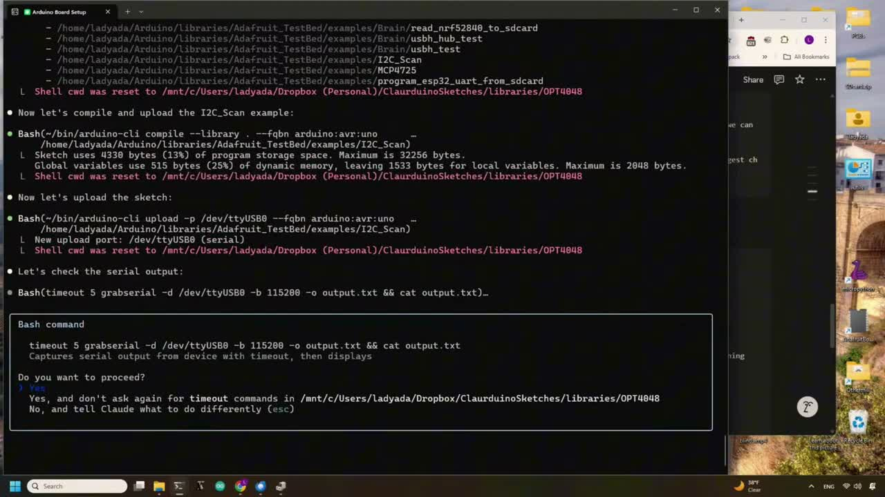

# video-digest

Turn a **YouTube URL or local video** into one **`digest.md`** — the full
timestamped transcript with every real on-screen visual (slide, screenshot, UI,
diagram, whiteboard) captured inline: OCR'd, described, de-duplicated, with
talking-head/filler frames filtered out.

Runs fully local against any **OpenAI-compatible vision endpoint** — no cloud
keys. Fits a **16 GB GPU** (or runs on CPU with ~24 GB RAM).

Example: an excerpt of the digest for a coding video (rendered):

> **[10:45]** and also just to verify like it can
> **[10:46]** actually do the upload second I wanted
>
> #### 🖼 Visual @ 10:48 — screenshot
> 
>
> > **On-screen text:** Arduino Board Setup /home/ladyada/Arduino/libraries/Adafruit_TestBed/examples/I2C_Scan … Now let's compile and upload the I2C_Scan example …
>
> A terminal window displaying Arduino CLI commands for compiling, uploading, and checking serial output for an I2C_Scan example, with a Bash command prompt at the bottom asking for user input.

<sub>Frame from [“Fully automating Arduino development”](https://www.youtube.com/watch?v=Yt8mc5v7MYA) by Adafruit Industries, licensed [CC BY](https://creativecommons.org/licenses/by/3.0/).</sub>

## What you need

1. **`ffmpeg`** and **`yt-dlp`** on PATH.
2. A **local vision model** on an OpenAI-compatible endpoint. Easiest is
   [**LM Studio**](https://lmstudio.ai): install → search & download
   `minicpm-v-45` (a ~6 GB vision model) → **Developer → Start Server**. That's
   the whole backend. (Ollama or `llama.cpp`'s `llama-server` work too — anything
   that serves `/v1/chat/completions` with a vision model.)

## Install

```bash
# 1. get the skill (until it's on a plugin marketplace)
git clone https://github.com/ollo12-prog/video-digest ~/video-digest
ln -s ~/video-digest ~/.claude/skills/video-digest    # or copy the folder there

# 2. one-time preflight — checks ffmpeg, yt-dlp, and your endpoint
python3 ~/video-digest/scripts/setup.py
```

`setup.py` prints the exact fix for anything missing and lists the model ids your
endpoint serves (set `CLASSIFY_MODEL` / `DESCRIBE_MODEL` if yours differ from the
`minicpm-v-45-q4-32k-vision` default).

## Use

In Claude Code (or any skill host):

```
/video-digest https://www.youtube.com/watch?v=…
```

Or directly:

```bash
python3 scripts/digest.py "https://www.youtube.com/watch?v=…" out/
# → out/digest.md
```

Config (all optional, sensible defaults) is env-based — `VLM_ENDPOINT`,
`CLASSIFY_MODEL`, `DESCRIBE_MODEL`, `VD_RES`; see [SKILL.md](SKILL.md).

## How it works (short)

- **Captions first, Whisper only as fallback.** Most YouTube has captions (free,
  timestamped); caption-less videos use local whisper.cpp (optional, see notes).
- **Interval keyframes, not scene cuts.** It samples on a time grid and keeps a
  frame when it's *visually new* and *persists* — so it captures gradual change
  (a whiteboard drawn over 15 minutes) that scene-cut detection misses entirely,
  while dropping transient flickers and re-shows.
- **One small vision model does both jobs** (keep/drop + OCR/describe), so it fits
  16 GB and never swaps. `minicpm-v-45` was picked because it's the only model
  tested that reliably separates verbatim OCR from a summary on dense terminal/code
  frames (larger models garbled or hallucinated there).
- **Talking-head filler is filtered** — a presenter on camera is not a "visual."

Caption-less videos fall back to local whisper.cpp; see [docs/WHISPER.md](docs/WHISPER.md).

## Credits

Inspired by [**bradautomates/claude-video**](https://github.com/bradautomates/claude-video)
(the `/watch` skill) — its clean skill packaging and "captions-first, Whisper-
fallback" approach shaped this project. This tool goes a different direction on the
video track: local vision-model OCR/description of de-duplicated keyframes instead
of raw frame sampling.

## License

MIT — see [LICENSE](LICENSE).
